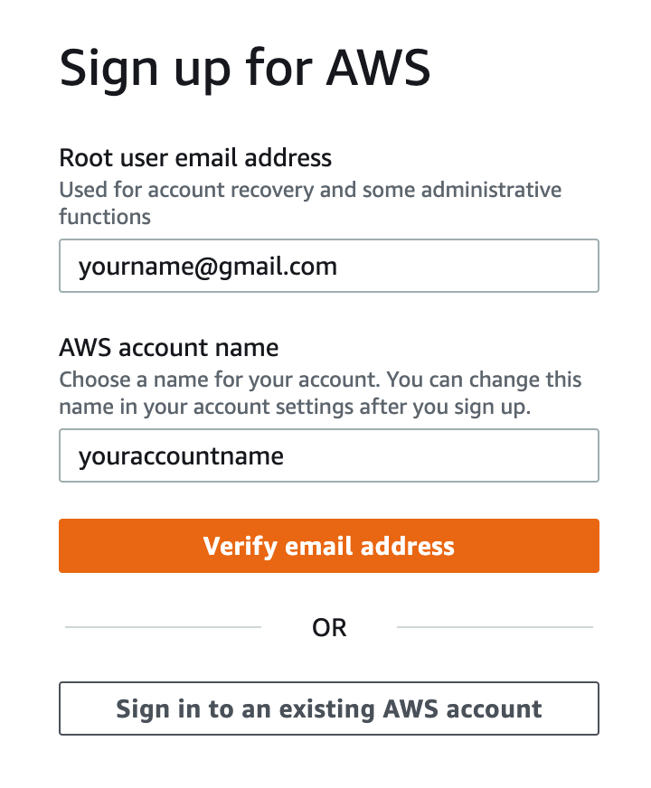
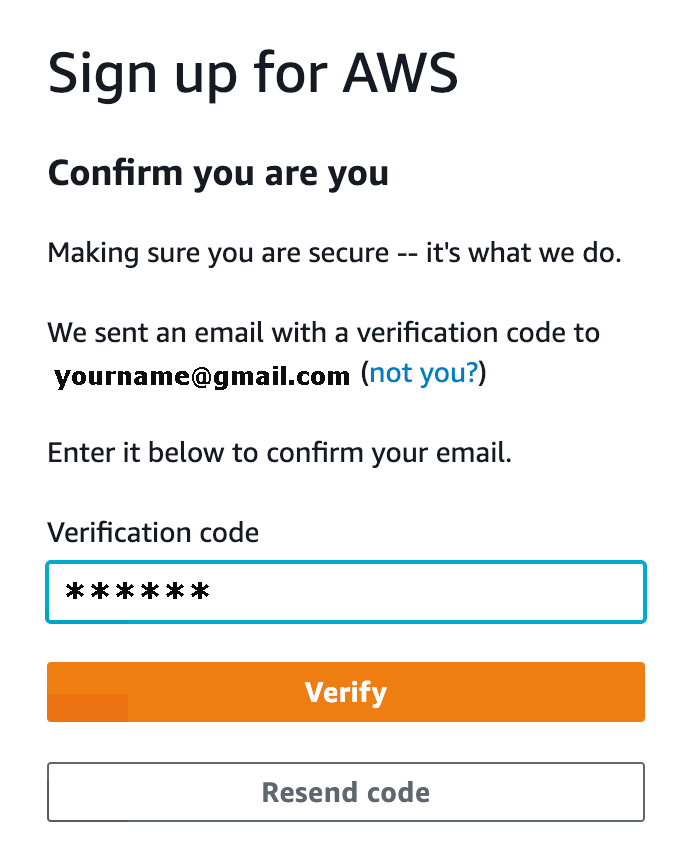
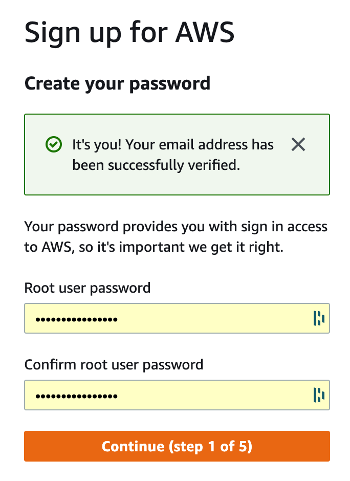
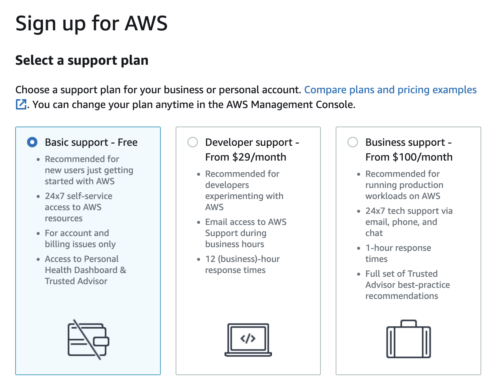
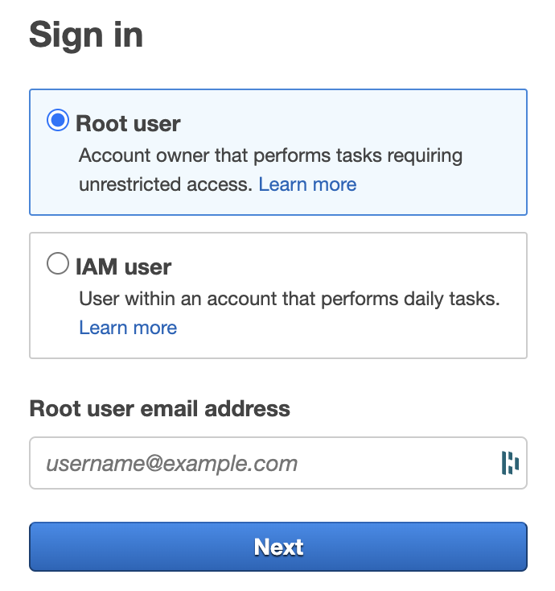

# IoT Connectivity Bootstrap

The purpose of this project is to provide a simple way of getting started quickly with connecting a MKR 1010 WIFI device with the Environment Shield  to AWS Core IoT, read telemetry for the envioronemnt,  persist and store data. 

# Required Hardware. 
* [Arduino MKR 1010 WIFI](https://store-usa.arduino.cc/products/arduino-mkr-wifi-1010)
* [Arduino MKR ENV Shield](https://store-usa.arduino.cc/products/arduino-mkr-env-shield-rev2)

* [USB 2.0 to Micro](https://www.walmart.com/ip/Mimifly-Micro-USB-Cable-2FT-2Pack-Android-Charger-USB-2-0-A-to-Micro-B-Charging-Cord-for-Samsung-Galaxy-S5-S6-S7-Edge-Note-4-5-LG-Moto-PS4-Black/711844429?athbdg=L1600) cable or [USB-C to Micro](https://www.walmart.com/ip/Cable-Matters-Cable-Matters-USB-C-to-Micro-USB-Cable-Micro-USB-to-USB-C-Cable-with-Braided-Jacket-6-6-Feet-in-Black/51374095) cable dependening on what ports your laptop has. You'll need to cable both to power the MKR 1010 WIFI and to upload the firmware. 

1. Attach the MKR 1010 ENV Shield on top of the the MKR 1010 Wifi. Make sure all of the pins align. It should only go on one way. 
2. Connect the USB cable to the MKR Wifi to power it. 
3. Download and install the drivers for the board. If you are using a Mac or Linux get the drivers from [here](https://www.silabs.com/products/development-tools/software/usb-to-uart-bridge-vcp-drivers). If you are on a Windows platform, download the drivers from [here](here).

# Configure an AWS Account
An AWS account will be needed to setup this bootstrap project. If you don't have one, you can start with the Free Tier account by signing up for a new account [here](https://aws.amazon.com/free). 

1. Click on the ***Create a Free Account*** button. This will bring you to the ***Acount Signup form***.

2. Enter an email for the ***Root user email address*** and a name for the account ***AWS Account Name***.
3. Click on the ***Verify email address*** button. This will bring you to the account verification form.
	
4. You should have recieved a temporary code in your email. Enter the code from your email in this verification form and click on the ***Verify*** button. This will take you to the ***Account Password*** form.
. Enter the password for the ***Root user password*** and ***Confirm Root User Password*** and click on the ***Continue*** button. This will bring you to the ***Contact Information*** form. 
5. Fill out your contact information and click on the ***Continue*** button. This will bring you to the billing information form. Your credit card informtion will be required to continue. You will not be charged so long ass you stay within the free tier confines. See [this](https://aws.amazon.com/free/free-tier-faqs/) for additional information and details on the free tier. Some screen shots will be omitted for brevity but filling them in should be fairly intuitive. 
6. Click on the ***Verify** button to continue. This will bring you to the ***Confirm your identity*** form. 
7. Fill in the required detils and click on the ***Send SMS*** button to continue. This will send you an SMS message or a phone call dependening on how you filled out the form. 
7. When you recieve the phone call or SMS message, enter the value in the ***Confirm your identity*** form and click on the ***Continue*** button to continue. 
8. This will bring you the the ***Support Plan*** configuration. 

9. Select the ***Basic Support - free*** option as that is all we will need for now. This should complete your account creation. Click on the 
10. Click on the ***Go to the AWS Management Console*** button or go to [this](https://aws.amazon.com/) link and click on ***Sign In to the Console button*** to log in to your new account. 
11. This should bring you to the ***Sign On** form. 

12. Click on the radio button for ***Root User*** and fill in the email address you used to create the account for ***Root user email address*** then click the ***Next*** button. 
13. This will bring you to the ***Password*** form. Enter in the password you set when creating the account and click on the ***Sign In** button. 
14. This should bring you to your dashboard. Bookmark this link. You'll need it in the future. 

## Setup your Arduino development environment and connect your device to AWS Core IoT

1. Follow the directions in [this](https://docs.arduino.cc/tutorials/mkr-wifi-1010/securely-connecting-an-arduino-mkr-wifi-1010-to-aws-iot-core) tutorial to setup the development environment, register your device with AWS Core IoT and test the connectivity of the device. 

	**Note:**  This tutorial includes a block of code referred to as a ***Sketch***. We will later be altering this with custom code to read telemetry from the MKR ENV Shield. In addition to this, AWS is constantly changing their UI so you may have to navigate around to find some options. 
	
	

